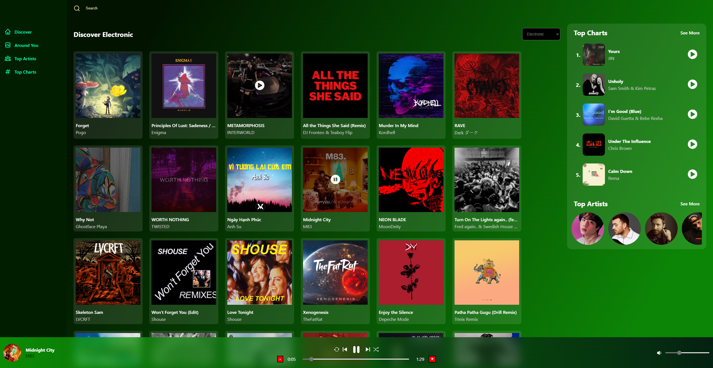
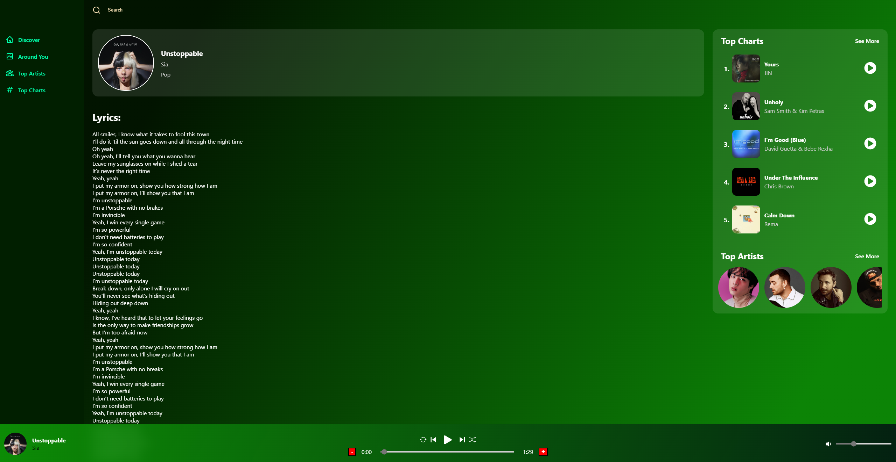

# Music App

## Table of Contents

- [Overview](#overview)
  - [The challenge](#the-challenge)
  - [Screenshots](#screenshots)
  - [Links](#links)
- [My process](#my-process)
  - [Built with](#built-with)
  - [What I learned](#what-i-learned)
  - [Continued development](#continued-development)
- [Author](#author)

## Overview

### The Challenge

The goal of this project was to create a music application, something similiar to Spotify or Shazam. 

Users should be able to:

    - See and listen to some of the most popular songs and artists right now
    - For any particular song, view its lyrics
    - For any particular song, view related songs
    - View some of an artist's most popular songs in their discography 
    - View popular songs by genre
    - View popular artists
    - View popular songs around a user given their country
    - Search songs given some input

### Screenshots

- Discover Page
    - Pop
    
    - Electronic
    

- Song Details
    - Lyrics
    
    - Related Songs
    

- Top Artists Page
    

- Top Charts Page
    

- Around You Page
    

### Links

- Live Site URL: [Music App](https://musical-donut-5e9f14.netlify.app/)

## My Process

### Built With

- [RapidApi](https://rapidapi.com/) - An API hub that makes it easier to find and connect to other APIs
- [Geoipify](https://geo.ipify.org/) - A geolocation API that allows you to find a location using an IP address
- [React](https://reactjs.org/) - A JS front-end library
- [Redux Toolkit](https://redux-toolkit.js.org/) - A package that standardizes the Redux state management library
- [Dotenv](https://www.dotenv.org/) - A module that safely and securely loads environment variables from a .env file into an application
- Custom CSS properties

### What I Learned

- A bit on how to use the audio element for media playback
- A bit on how to use useRef and refs in React and when to use them
- How to use the Geoipify API for geolocation

### Continued Development

Going forward, I would like to get the Around You page to function properly at all times. The page uses the Geoipify API to find country based on IP address andthen uses that information to find about songs currently popular in that country and, finally, display that information to the user. Sometimes, the information doesn't get pulled resulting in the songs section being blank.

## Author
- Website - [Christopher Cox](https://chriscox12.github.io/)